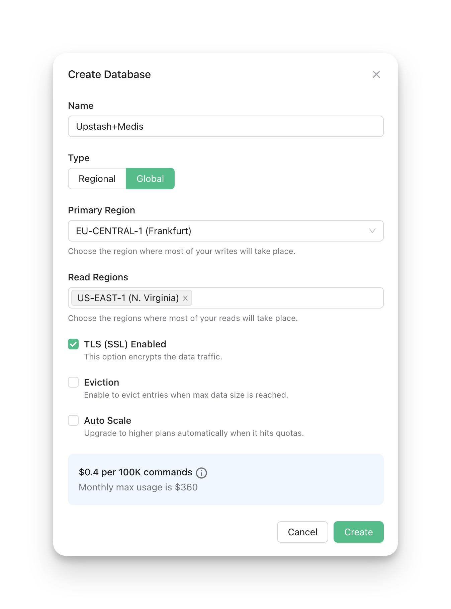
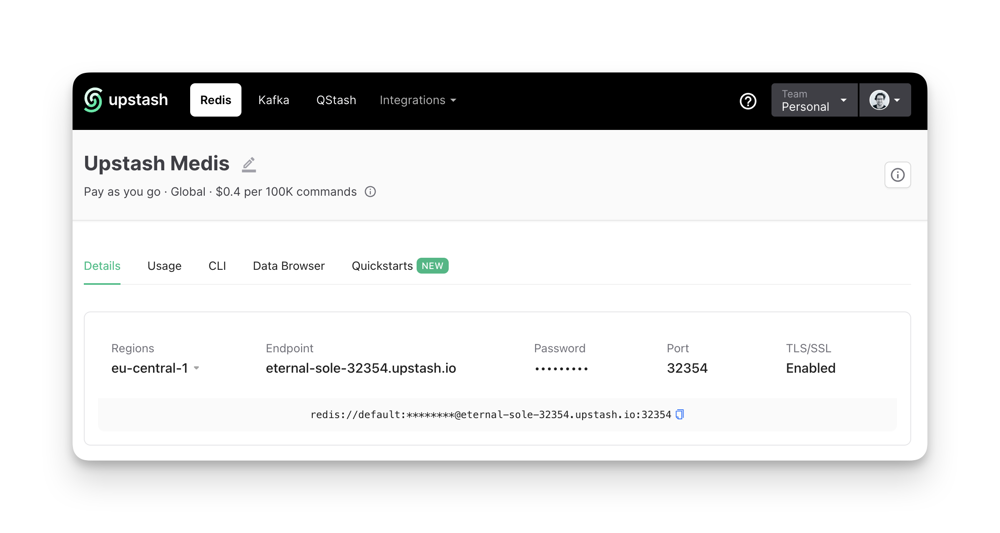
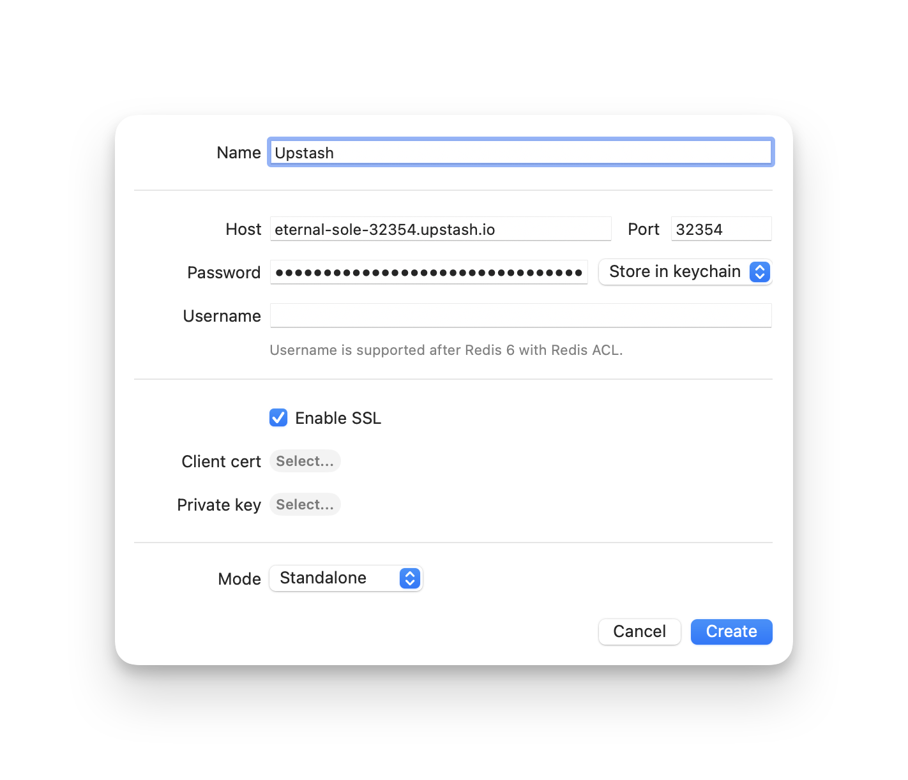

# Upstash Redis

Upstash Redis provides a fully managed highly available Redis compatible
database.

## Create a Database

To create a database, you need to go to the
[Upstash Console](https://console.upstash.com/redis?new=true&ref=medis) and
enter a name for your database. You can also choose the regions where you want
to create your database.

## Connect to the Database

Once you have created a database, you can connect to it using the connection
string. You can find the connection string in the database details page.

## Connect to the Database using Medis

Lastly open Medis and click on the `New Server` button. Enter the `Host`, `Port`
and `Password`, but leave the `Username` empty.

If you have enabled `TLS (SSL)` on your database, you need to enable it in Medis
as well.

